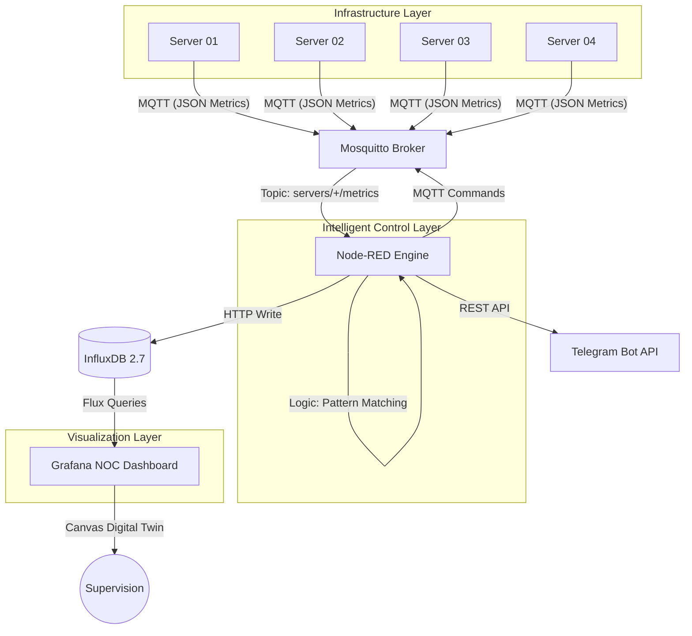

# 🌐 IoT Load Balancer & Digital Twin Command Center

## 📖 Overview
This project is a high-availability **IoT Monitoring & Load Balancing System**. It simulates a cluster of AI-driven servers monitored by a real-time **Digital Twin**. The system features autonomous self-healing capabilities, advanced predictive analysis, and a focus on **Green IT** (carbon footprint tracking).

## 🏗️ Architecture

## 🚀 Key Features
- **Intelligent Digital Twin**: Real-time canvas topography with dynamic connection lines and color-coded statuses (Grafana 13).
- **Autonomous Load Balancing**: Node-RED logic automatically migrates simulated workloads to healthy servers when overload is detected.
- **Green IT Integration**: Automated tracking of temperature (correlated with CPU heat) and CO2 footprint (gCO2/h).
- **Command & Control API**: Bidirectional communication allowing manual server overrides via REST API.
- **Resilience Testing**: Integrated "Chaos Monkey" Python script to simulate real-world DDoS and overload attacks.

## 🛠️ Tech Stack
- **Edge Simulation**: Python 3.12 (Paho-MQTT)
- **Messaging**: Eclipse Mosquitto (MQTT v5, PBKDF2 Auth)
- **Orchestration**: Node-RED (Autonomous Logic & API)
- **Database**: InfluxDB 2.7 (Time-series optimization)
- **Visualization**: Grafana 13.0.1 (Dynamic Canvas & NOC panels)
- **Deployment**: Docker Compose

## 🚦 Quick Start
1. **Clone Repo**: `git clone <your-repo-url>`
2. **Install Deps**: `pip install -r requirements.txt`
3. **Launch Stack**: `docker-compose up -d --build`
4. **Access Dashboard**: `http://localhost:3000` (User: `admin` / Pass: `admin`)
5. **Simulate Attack**: `python chaos_monkey.py server2`
6. **Monitor API**: `curl http://localhost:1880/api/status`

## ⚖️ License
Distributed under the **MIT License**. See `LICENSE` for more information.

---
*Developed as a professional-grade IoT Supervision Proof of Concept.*
